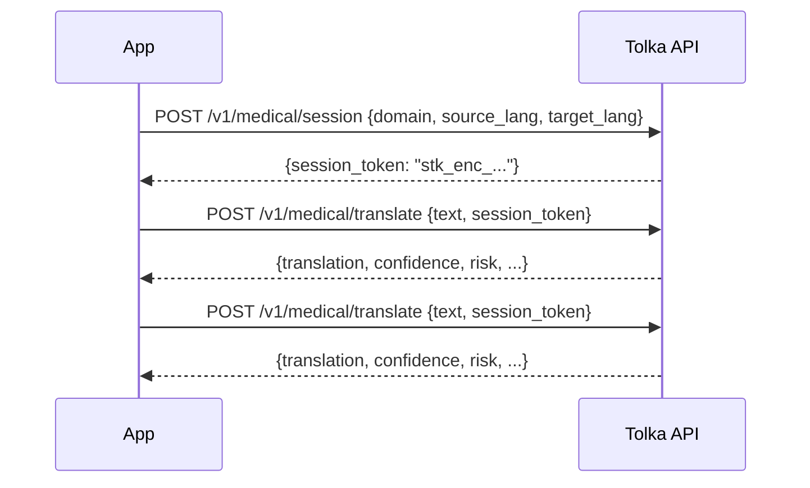

import { Tabs, TabItem, Aside } from '@astrojs/starlight/components';

Sessions allow you to maintain context across multiple translation exchanges in a single clinical encounter (e.g., a GP consultation with several questions and answers). Session state is encrypted and stored client-side — Tolka's servers are stateless.

---

## How sessions work

1. **Create a session** — `POST /v1/medical/session` returns an encrypted token representing the session context.
2. **Pass the token** — Include the session token in subsequent translate calls via the `session_token` field.
3. **Token expiry** — Tokens have a configurable TTL (default: 60 minutes). An expired token returns `401 SESSION_EXPIRED`.



---

## Create a session

<Tabs>
<TabItem label="TypeScript">
```typescript
const session = await tolka.sessions.create({
  domain: 'gp',
  sourceLang: 'ar',
  targetLang: 'nb',
  ttlMinutes: 45,
});

// session.token — store this in your app state, not in the URL or localStorage
console.log(session.token); // "stk_enc_01HX..."
```
</TabItem>
<TabItem label="cURL">
```bash
curl -X POST https://api.tolka.health/v1/medical/session \
  -H "Authorization: Bearer $TOLKA_API_KEY" \
  -H "Content-Type: application/json" \
  -d '{
    "domain": "gp",
    "source_lang": "ar",
    "target_lang": "nb",
    "ttl_minutes": 45
  }'
```
</TabItem>
</Tabs>

---

## Use a session in translations

```typescript
const result = await tolka.translate({
  text: 'كيف حالك اليوم؟',
  sessionToken: session.token,
  // source_lang and target_lang are optional when session_token is present
  // — they are inferred from the session
});
```

---

## Security considerations

- **Store tokens in memory** (JavaScript variable or React state), not in `localStorage`, `sessionStorage`, or cookies. Session tokens contain encrypted clinical context.
- **Do not log tokens** — they represent encrypted session state and should be treated as secrets.
- **One token per clinical encounter** — Create a new session for each distinct patient encounter. Reusing tokens across encounters is a data hygiene risk.
- Tokens are encrypted with a server-side key. Even if a token is intercepted, it cannot be decoded without the Tolka server key.

:::danger[Do not share session tokens between patients]
Each session token carries context from all translations in the encounter. Sharing a token between two different patients risks context bleed.
:::

---

## Token TTL and expiry

The default TTL is **60 minutes** from creation. You can set `ttl_minutes` between 15 and 480 (8 hours).

When a token expires:

```json
{
  "error": {
    "code": "SESSION_EXPIRED",
    "message": "Session token has expired. Create a new session to continue."
  }
}
```

Handle this gracefully in your UI — typically by creating a new session and continuing the encounter, not by surfacing a raw error to the clinician.

---

## What's next

- [POST /session reference →](/api-reference/sessions/)
- [GP Consultation guide — session-based conversation flow →](/guides/gp-consultation/)

