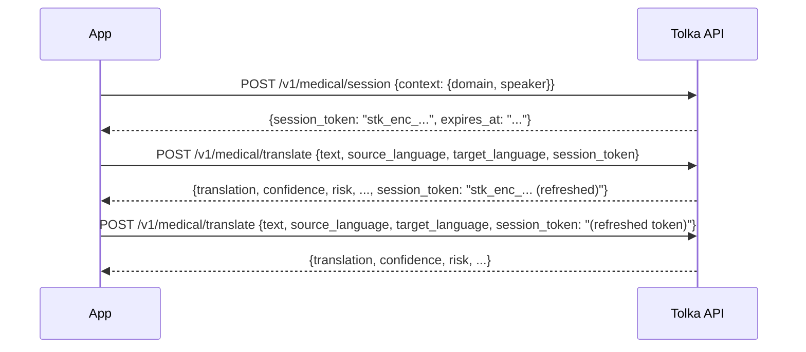

import { Tabs, TabItem, Aside } from '@astrojs/starlight/components';

Sessions let you carry `domain`/`speaker` context across multiple translation exchanges in a single clinical encounter (e.g., a GP consultation with several questions and answers), without repeating `context` on every call. Session state is encrypted and stored client-side — Tolka's servers are stateless. Sessions do **not** carry language — `source_language`/`target_language` are still required on every `translate()`/`safeTranslate()` call.

---

## How sessions work

1. **Create a session** — `POST /v1/medical/session` returns an encrypted token representing `domain`+`speaker`.
2. **Pass the token** — Include the session token in subsequent translate calls via the `session_token` field.
3. **Token expiry** — Fixed 15-minute idle TTL, 60-minute hard maximum — not configurable. An expired token returns `400 session_expired`.
4. **Token refresh** — Every response made with a `session_token` includes a refreshed one; store it back to keep the idle TTL alive.


```mermaid
sequenceDiagram
  participant App
  participant Tolka API
  App->>Tolka API: POST /v1/medical/session {context: {domain, speaker}}
  Tolka API-->>App: {session_token: "stk_enc_...", expires_at: "..."}
  App->>Tolka API: POST /v1/medical/translate {text, source_language, target_language, session_token}
  Tolka API-->>App: {translation, confidence, risk, ..., session_token: "stk_enc_... (refreshed)"}
  App->>Tolka API: POST /v1/medical/translate {text, source_language, target_language, session_token: "(refreshed token)"}
  Tolka API-->>App: {translation, confidence, risk, ...}
```

---

## Create a session

<Tabs>
<TabItem label="TypeScript">
```typescript
const session = await tolka.createSession({ domain: 'gp', speaker: 'doctor' });

// session.session_token — store this in your app state, not in the URL or localStorage
console.log(session.session_token); // "stk_enc_01HX..."
console.log(session.expires_at);    // ISO 8601 string
```
</TabItem>
<TabItem label="cURL">
```bash
curl -X POST https://api.tolka.health/v1/medical/session \
  -H "Authorization: Bearer $TOLKA_API_KEY" \
  -H "Content-Type: application/json" \
  -d '{
    "context": { "domain": "gp", "speaker": "doctor" }
  }'
```
</TabItem>
</Tabs>

---

## Use a session in translations

```typescript
const result = await tolka.translate({
  text: 'كيف حالك اليوم؟',
  source_language: 'ar',
  target_language: 'no',
  mode: 'standard',
  session_token: session.session_token,
  // context omitted — domain/speaker inherited from the session
});

// Store the refreshed token for the next call in this encounter
const nextSessionToken = result.session_token ?? session.session_token;
```

---

## Security considerations

- **Store tokens in memory** (JavaScript variable or React state), not in `localStorage`, `sessionStorage`, or cookies. Session tokens contain encrypted clinical context.
- **Do not log tokens** — they represent encrypted session state and should be treated as secrets.
- **One token per clinical encounter** — Create a new session for each distinct patient encounter. Reusing tokens across encounters is a data hygiene risk.
- Tokens are encrypted with a server-side key. Even if a token is intercepted, it cannot be decoded without the Tolka server key.

:::danger[Do not share session tokens between patients]
Each session token carries context from all translations in the encounter. Sharing a token between two different patients risks context bleed.
:::

---

## Token TTL and expiry

The TTL is fixed: **15 minutes idle**, **60 minutes hard maximum** from creation, whichever comes first. There's no request parameter to change this.

When a token expires:

```json
{
  "error_code": "session_expired",
  "message": "Session has expired. Start a new session."
}
```

Handle this gracefully in your UI — typically by creating a new session and continuing the encounter, not by surfacing a raw error to the clinician.

---

## What's next

- [POST /session reference →](/api-reference/sessions/)
- [GP Consultation guide — session-based conversation flow →](/guides/gp-consultation/)
